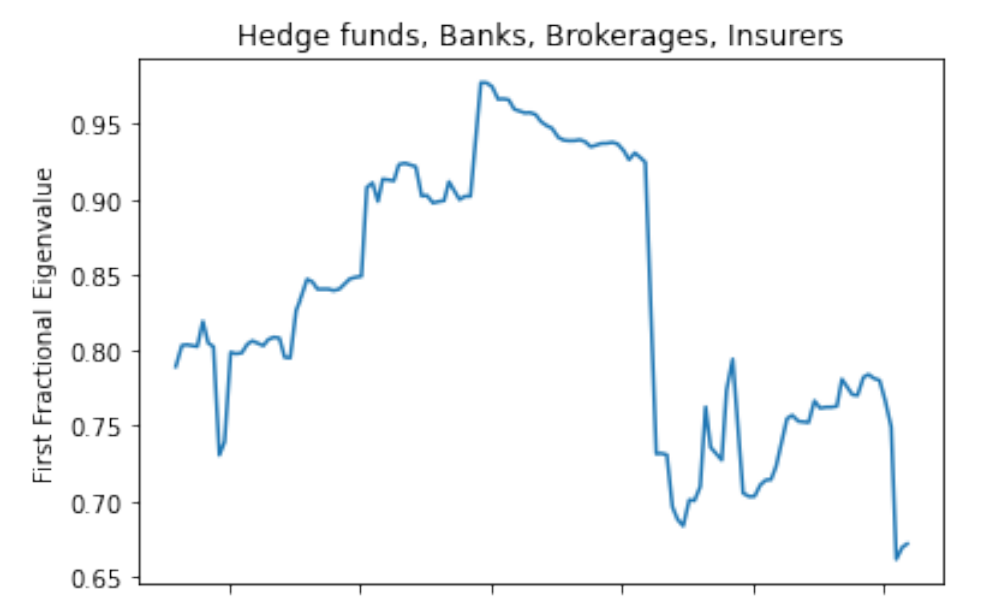
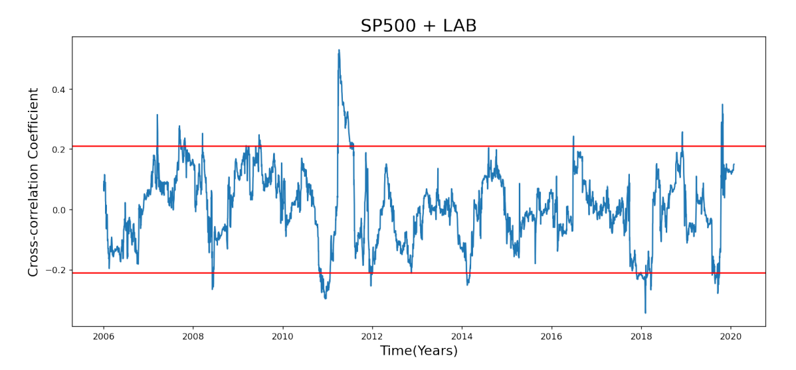
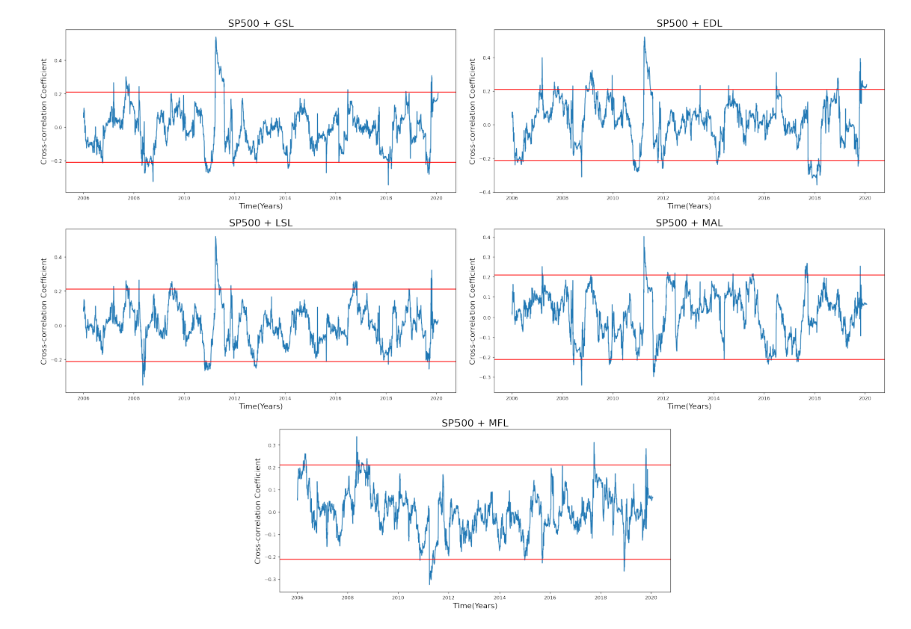

# Macro-trends_research
## Project Description

2020-2021 Research Project as a Research Assistant at University of Chicago diagnosing roots of systemic risk in financial markets during the 2008 recession.
Conducted principal component analysis (PCA) of various financial sectors Open, High, Low, Close (OHCL) data (e.g. banks, insurers, brokerages, hedge funds)
to measure systemic risk throughout general market, then used cross-correlation models to compare sector vs. sector friction/ imposed risk specifically on
different types of hedge fund strategy (e.g. merger arbitrage, long/short) OHCL data compared to SP500 OHCL data as a general market indicator to determine
imposed risk of specific hedge fund sectors/ investment strategies and gave possible explanations for market friction/ risk noticed in the models.

## Analysis Explanation/ Details

To measure market risk we assume that market friction implies market risk as a strong influence of one asset on another creates a greater chance of systemic failure
across both assets. Thus, given relatively efficient markets such as US financial markets, assets/ sectors should move relatively random and uncorrelated with one
another, which would suggest that moments of asset correlation could signal inefficiencies between assets and therefore market friction/ risk. This allows us to use
principal component analysis (PCA) to analyze asset correlation over time series data by looking for rises in the cumulative proportion of the first few eigenvalues of
the covariance matrix of the time-series data over a rolling window which would signify market correlation over time and show moments of potential market risk. Having
found spikes in potentital market risk through the PCA data, we then use cross-correlation models to analyze imposed risk between two specific sectors rather than all
sectors together to specifically diagnose areas of risk. In this research we primarily focus on the impact of hedge funds on the market and specific hedge fund
strategies using data of a hedge fund index and sub-indices of specific strategies. 

## Screenshots of plots

Plot of first fractional eigenvalues of return data from indices of Banks, Brokerages, Insurers, and
the LAB hedge fund index over rolling windows of 30 time periods from over a 174 month range from January 2006 to June 2020.

Cross-correlation coefficients plot (represented by blue line) with significance bands (red line)
between the LAB hedge fund index and S&P 500 over the 174-month time frame from January 2006 to June 2020.

Cross-correlation coefficients plot (represented by blue line) with significance bands (red line)
between the GSL, EDL, LSL, MAL, and MFL hedge fund sub-indices and the S&P 500 over the 174-month
time frame from January 2006 to June 2020.

EDL Index: Develops trading strategies to create returns and solid out of global events (e.g. elections,
corporate situations/ activities, mergers and acquisitions deals, etc.)
GSL Index: Reflects the return of all remaining hedge fund strategies not defined as Long/Short or Event
Driven
LSL Index: Strategy that takes a long term position on underpriced equities and also selling short equities
that are expected to decline in value
MFL Index: Uses a pre-defined quantitative methodology to invest in a range of asset classes including:
equities, fixed income, commodities and currencies
MAL Index: Uses using a pre-defined quantitative methodology to invest in a liquid, diversified and
broadly representative set of announced merger deals
